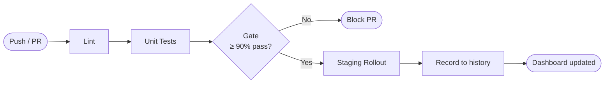
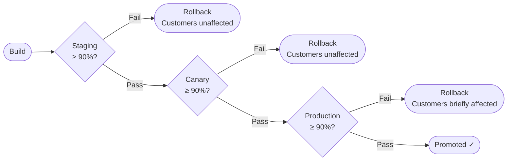

[](https://release-health.streamlit.app)
[](https://github.com/pblue157/void/actions/workflows/ci.yml)

# QA Validation Platform

A QA platform for simulating firmware rollouts on a device fleet, checking if release is good enough to promote, and showing the results in a [live dashboard](https://release-health.streamlit.app/).

---

## What it does

- **Simulates a device fleet** — virtual devices get firmware updates and some of them fail and roll back, like in real deployments.
- **Runs automated tests** — pytest checks each rollout and saves results to a JSON report.
- **Enforces quality gates** — checks test results against rules like minimum pass rate and blocks the release if something is not okay.
- **Detects flaky tests** — finds tests that sometimes pass and sometimes fail across different runs.
- **Visualises release health** — Streamlit dashboard shows pass rate over time, rollback count, MTTR, and full event log per device.

---

## Setup

**1. Clone the repo and install dependencies**

```bash
git clone <repo-url>
cd open_qa
pip install -r requirements.txt
```

**2. Seed historical data** *(optional — fills the dashboard with some sample history to look at)*

```bash
python scripts/seed_flake_history.py
```

---

## Running

**Run the test suite**

```bash
pytest --json-report --json-report-file=reports/pytest-results.json
```

**Launch the dashboard**

```bash
streamlit run dashboard/app.py
```

Open [http://localhost:8501](http://localhost:8501) in browser.

---

## CI Pipeline



**Promotion conditions:**

- Pass rate must be **>= 90%** — if not, pipeline exits with code 1 and the PR is blocked
- If gate passes, a staging rollout is simulated and the result is appended to `test_history.json`
- Every run (pass or fail) is recorded so the dashboard always reflects real CI health

---

## Promotion Flow

A build only reaches production if it passes all three stages in order:



- **Staging** — small internal group, fail here and nothing goes further
- **Canary** — small slice of real devices, still safe to roll back cleanly
- **Production** — full fleet, a failure here means customers briefly got the bad firmware before rollback

---

## Configuration

| File | Purpose |
|---|---|
| `configs/fleet_config.yaml` | Device groups and firmware versions |
| `configs/promotion_rules.yaml` | Pass-rate thresholds and gate rules |
| `configs/flake_config.yaml` | Flake detection sensitivity |
| `configs/quarantined_tests.yaml` | Tests excluded from gate evaluation |

